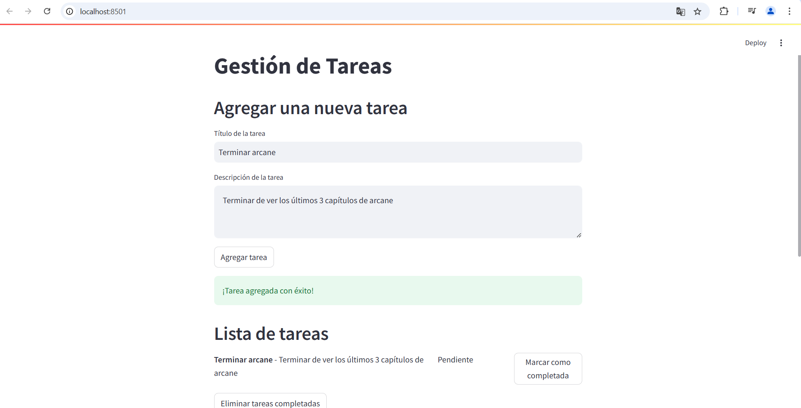
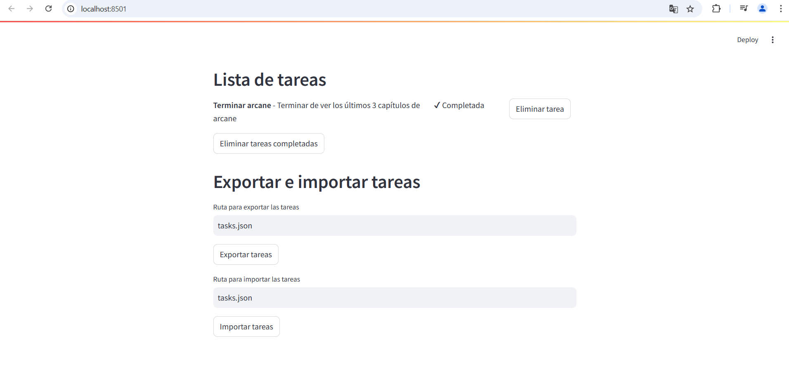
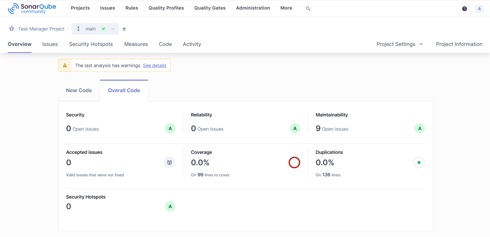

# Gestor de Tareas con Streamlit y SQLAlchemy

Este es un proyecto de aplicación para gestionar tareas. Utiliza **Streamlit** para la interfaz de usuario y **SQLAlchemy** para interactuar con una base de datos.

---

## Enunciado del proyecto

Desarrolla una Aplicación de Gestión de Tareas

Crea una aplicación en Python que permita a los usuarios gestionar sus tareas diarias. La aplicación debe incluir las siguientes funcionalidades:

1. Agregar Tareas:
        Permitir al usuario agregar nuevas tareas con un título y una descripción.
2. Listar Tareas:
        Mostrar todas las tareas agregadas con su estado (pendiente o completada).
3. Marcar Tareas como Completadas:
        Permitir al usuario marcar una tarea como completada.
4. Eliminar Tareas:
        Permitir al usuario eliminar tareas completadas.
5. Guardar y Cargar Tareas:
        Puede exportar las tareas en un archivo e importar las desde el mismo archivo.
6. Interfaz
        Puedes crear una interfaz gráfica (ideal streamlit)

Requisitos Técnicos:

* Utiliza estructuras de datos como listas y diccionarios.
* Maneja excepciones para asegurar que la aplicación no se cierre inesperadamente.
* Utiliza módulos estándar de Python como json para importar y exportar tareas.
* Utiliza una conexión a una base de datos sql para tener persistencia de datos (ideal SQLAlchemy).

---

## Estructura del Proyecto

El proyecto está organizado de la siguiente manera:

```
gestionDeTareasPython/
├── app.py          # Archivo principal para ejecutar la aplicación
├── db/             # Lógica relacionada con la base de datos
│   ├── models.py   # Modelos de la base de datos
│   ├── controllers.py # Controladores para operaciones en la BD
├── utils/          # Utilidades adicionales
│   ├── file_io.py  # Exportar e importar tareas en formato JSON
├── README.md       # Documentación del proyecto
```

---

## Requisitos

Asegúrese de tener los siguientes elementos instalados:

- Python 3.10 o superior
- Pip (administrador de paquetes de Python)
- MySQL Server (si se usa base de datos remota/local, opcional para SQLite)

---

## Instalación

1. **Clonar el repositorio**:

   ```bash
   git clone https://github.com/JuanManuelGilQuiroga/gestionDeTareasPython
   cd gestionDeTareasPython
   ```

2. **Instalar las dependencias**:

   ```bash
   pip install streamlit sqlalchemy
   ```


## Ejecución de la Aplicación

1. **Ejecutar la aplicación**:

   ```bash
    python -m streamlit run app.py
   ```

2. **Abrir en el navegador**:
   La aplicación estará disponible en [http://localhost:8501](http://localhost:8501).

---

La base de datos se creará automáticamente al ejecutar la aplicación si no existe.

---

## Exportar e Importar Tareas

La aplicación permite exportar e importar tareas en formato JSON:

1. **Exportar**: Proporcione una ruta de archivo (el nombre del archivo, Ej: tasks.json) y haga clic en "Exportar tareas".
2. **Importar**: Proporcione una ruta de archivo JSON válida (el nombre del archivo, Ej: tasks.json) y haga clic en "Importar tareas".

---

## Tecnologías Utilizadas

- **Streamlit**: Framework para la interfaz de usuario.
- **SQLAlchemy**: ORM para interacción con la base de datos.
- **Python**: Lenguaje de programación principal.

---

## Capturas de Pantalla




## Sonarqube


